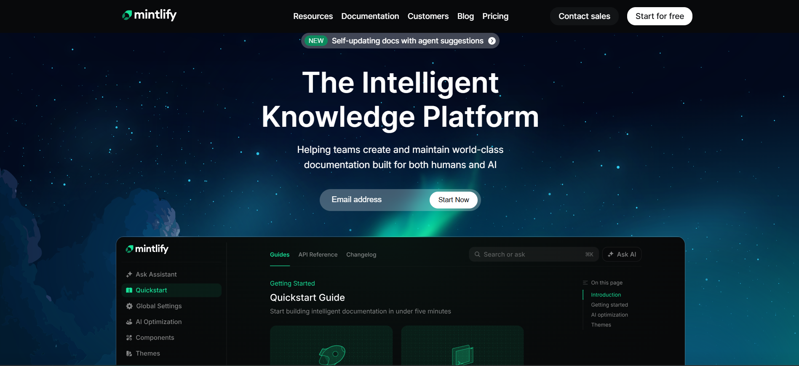
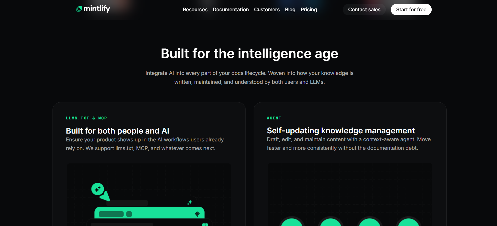

# Mintlify Landing Page Clone

A recreation of the Mintlify landing page, built with HTML and CSS. This project showcases modern web design principles, clean typography, and engaging user interface elements.

## 📋 Sections Recreated

This landing page includes the following sections:

### 1. **Navigation Bar**
- Sticky navigation with blur effect
- Logo, menu items, and action buttons
- Grid-based responsive layout

### 2. **Hero Section**
- Large hero banner with background gradient
- Notification badge for new features
- Email signup form with call-to-action
- Hero image with backdrop blur effect

### 3. **Customers Section**
- Logo grid showcasing trusted brands
- Features logos from: Anthropic, Coinbase, Microsoft, Perplexity, HubSpot, X, PayPal, and Lovable

### 4. **Features Section**
- Two-column feature grid
- Feature cards with tags, titles, descriptions, and images
- Hover effects for enhanced interactivity

### 5. **Assistant Section**
- Highlighted container with border effects
- Centered content layout
- Large feature image showcase

### 6. **Enterprise Section**
- Two-column layout for enterprise features
- Partnership and compliance information
- Customer story showcase with background image
- Logo carousel of enterprise clients

### 7. **Customer Showcase Section**
- Grid of customer case studies
- Card-based layout with images
- "Read story" call-to-actions

### 8. **CTA (Call-to-Action) Section**
- Main conversion section
- Primary and secondary action buttons
- Feature highlights with icons
- Links to pricing and quickstart guides

### 9. **Footer**
- Comprehensive footer with multiple columns
- Links organized by category: Explore, Resources, Documentation, Company, Legal
- Social media icons (LinkedIn, X/Twitter, GitHub)
- SOC 2 security badge
- System status indicator
- Theme toggle buttons
- Copyright information

## 🎨 Design System

### **Fonts**

The project uses two primary font families from Google Fonts:

1. **Inter** - Used for body text and most UI elements
   - Sans-serif typeface
   - Multiple weights (100-900)
   - Excellent readability for UI text

2. **Geist Mono** - Used for technical tags and code-related text
   - Monospace typeface
   - Used for feature tags and technical labels
   - Multiple weights (100-900)

### **Color Palette**

```css
/* Primary Colors */
--white: lab(100% 0 0);              /* Pure white */
--bg-color: #08090b;                 /* Dark background */
--mint-accent: #18e299;              /* Primary accent color */
--mint-faded: #90ecc5;               /* Faded mint */
--mint-dark: #0c8c5e;                /* Dark mint */
```

**Color Usage:**
- **Background**: `#08090b` - Deep dark background for modern aesthetic
- **Accent/Brand**: `#18e299` - Vibrant mint green for CTAs and highlights
- **Text**: White with varying opacity levels for hierarchy
  - `rgba(255, 255, 255, 1)` - Primary text
  - `rgba(255, 255, 255, 0.75)` - Secondary text
  - `rgba(255, 255, 255, 0.65)` - Tertiary text
  - `rgba(255, 255, 255, 0.5)` - Muted text

## 📸 Screenshots

### Full Page View


### Detailed Sections



## 📁 Project Structure

```
mintlify/
├── index.html           # Main HTML file
├── style.css           # All styles in one file
├── assets/
│   ├── bg/            # Background images
│   ├── feature/       # Feature section images
│   ├── logos/         # Brand logos
│   ├── screenshots/   # Project screenshots
│   └── trusted-by-logos/  # Partner company logos
└── README.md          # This file
```

